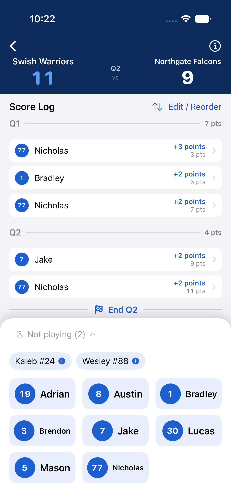
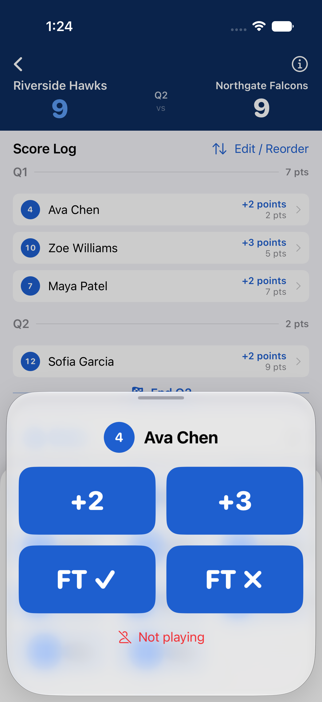
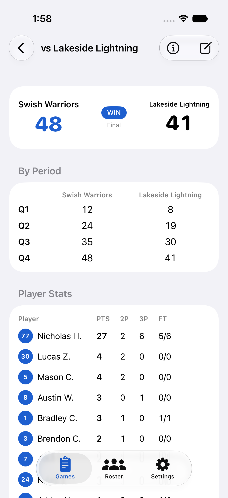
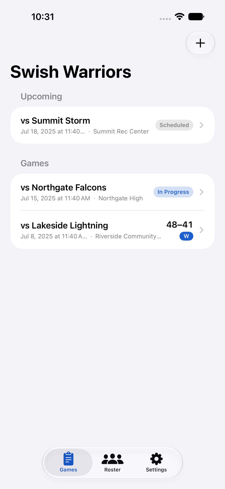
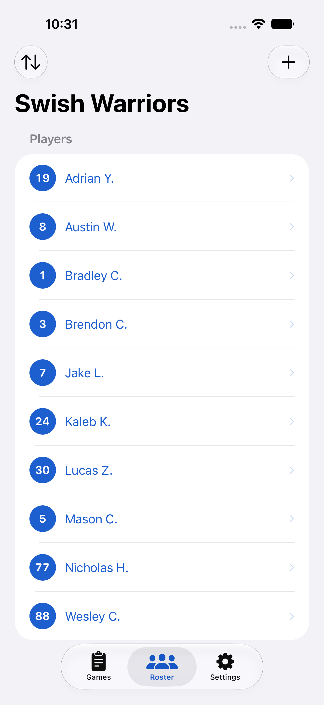
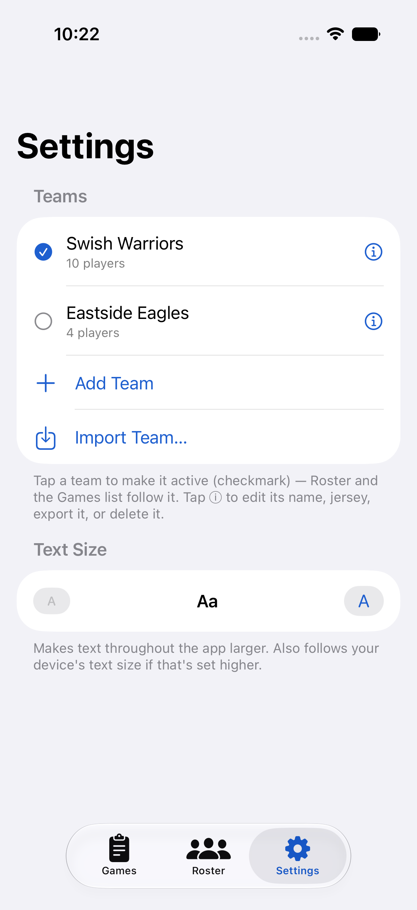
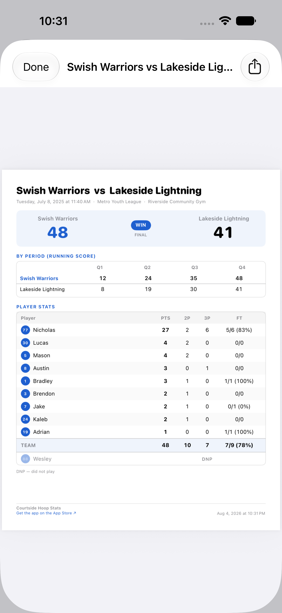

# Courtside Hoop Stats

## 🎉📱 [Now on the App Store!](https://apps.apple.com/us/app/courtside-hoop-stats/id6791865094) 🏀🎉

A native iOS app for tracking youth basketball stats **courtside** — fast,
one-handed point entry to replace a manual spreadsheet. SwiftUI, iOS 26+, zero
third-party dependencies, local storage (UserDefaults/JSON).

The idea was my wife's — she wanted to replace her
text-to-herself-during-the-game-scoring "system" 😂

Home-screen name: **Courtside** · Bundle: `com.thomashan.CourtsideHoopStats`

## Screenshots

<p align="center">
  
</p>

| Live scoring (absentees benched) | Tap to score | Game summary |
|---|---|---|
|  |  |  |

| Games | Roster | Teams (Settings) |
|---|---|---|
|  |  |  |

| Box score PDF — preview, then share to the group chat |
|---|
|  |

## What it does

- **Live scoring** — tap a player → a big point pad (+2 / +3 / FT ✓ / FT ✗).
  Players show by **first name** for fast, unambiguous tapping. The score log
  stays on top (with sticky period headers); players sit in the thumb zone.
  Bench absent players; reorder or edit any entry.
- **Games** — tap **+** to open the New Game form, where every field is optional.
  Hit **Start Game** to begin scoring right away, or **Save** to schedule it for
  later.
- **Teams** — manage multiple teams in Settings, and **export/import** a team
  (roster + games) to move it between devices or back it up. Roster and Games
  follow the active team.
- **Summary** — final score, cumulative by-period linescore, and per-player stats
  including **FT%** (e.g. `5/6 (83%)`).
- **Box score PDF** — export the summary as a clean one-page PDF and share it
  (AirDrop / Messages / Files). Preview it first, so you see exactly what lands
  in the parents' group chat. Players who didn't play are listed **DNP**,
  NBA-style. Rendered on device; nothing is uploaded.

## Build

```bash
open CourtsideHoopStats.xcodeproj   # Xcode 16+, iOS 26 SDK
```

Set your signing **Team** on the CourtsideHoopStats target the first time.

Screenshots above are generated by the UI-test harness — run
`scripts/screenshots.sh` (see [`docs/SCREENSHOTS.md`](docs/SCREENSHOTS.md)).

The backlog lives in **GitHub Issues**. Product spec:
[`docs/REQUIREMENTS.md`](docs/REQUIREMENTS.md).
