# Courtside Hoop Stats

## 🎉📱 [Now on the App Store!](https://apps.apple.com/us/app/courtside-hoop-stats/id6791865094) 🏀🎉

A native iOS app for tracking youth basketball stats **courtside** — fast,
one-handed point entry to replace a manual spreadsheet. SwiftUI, iOS 26+, zero
third-party dependencies, local storage (UserDefaults/JSON).

The idea was my wife's — she wanted to replace her
text-to-herself-during-the-game-scoring "system" 😂

Home-screen name: **Courtside** · Bundle: `com.thomashan.CourtsideHoopStats`

## Screenshots

<p align="center">
  
</p>

### Scoring courtside

The main event: two taps per basket, big targets, and the score log always
visible. Absent players are benched so the grid stays uncluttered.

| 1. Live scoring | 2. Tap a player, then the basket | 3. Fix anything, anytime |
|---|---|---|
| 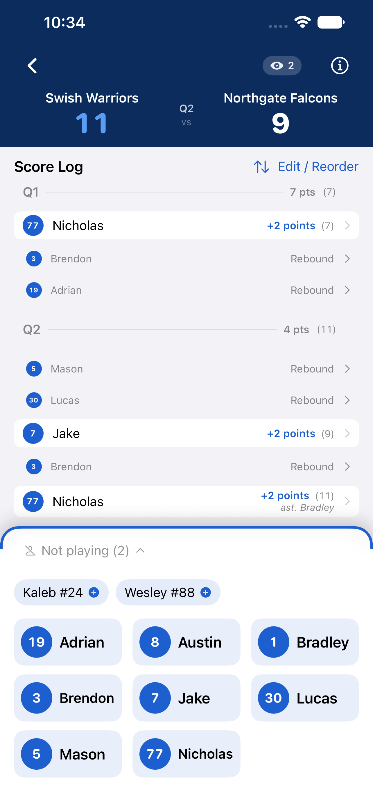 | 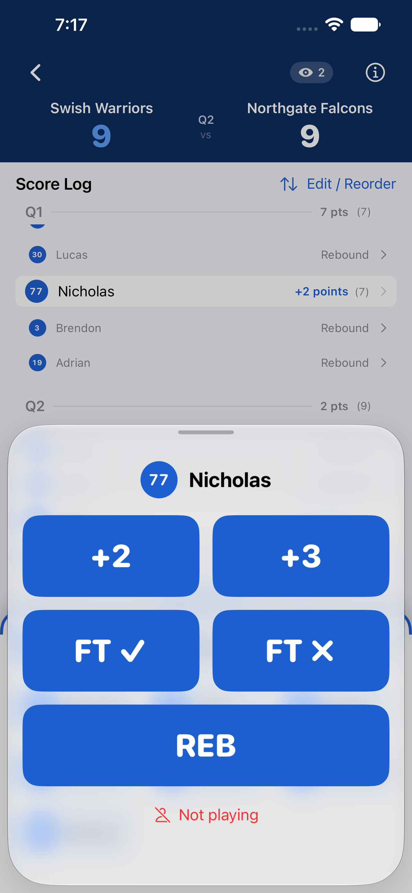 | 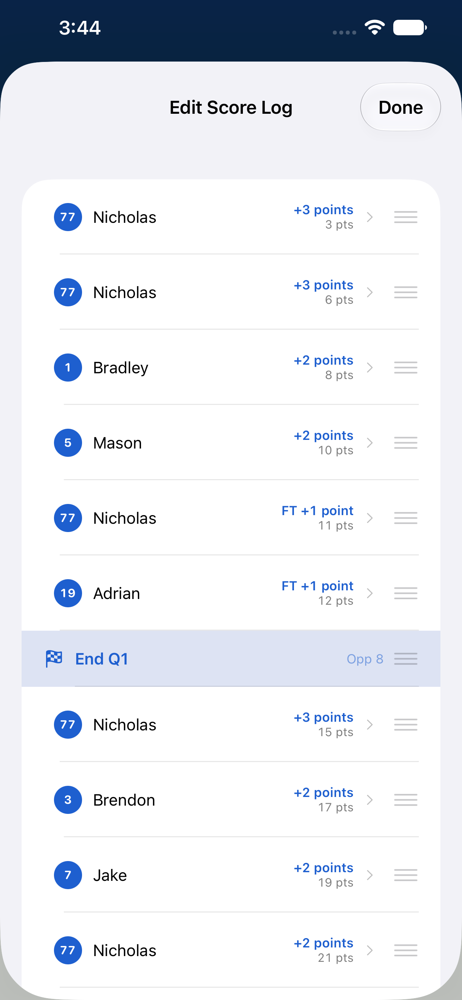 |

### Starting a game

Every field is optional — **Start Game** to score right now, or **Save** to
schedule it. Locations autocomplete from Maps and from gyms you've used before.

| 4. New game |
|---|
| 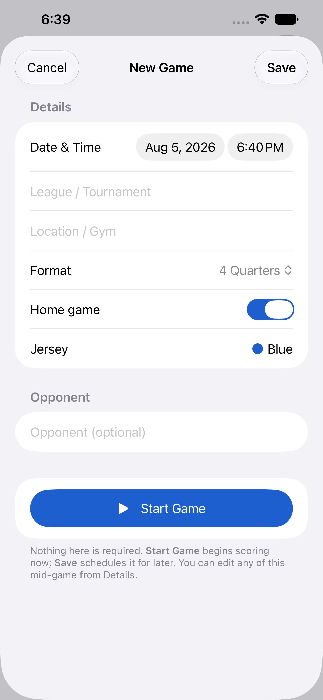 |

### After the game

| 5. Game summary | 6. Box score PDF — preview, then send to the group chat |
|---|---|
| 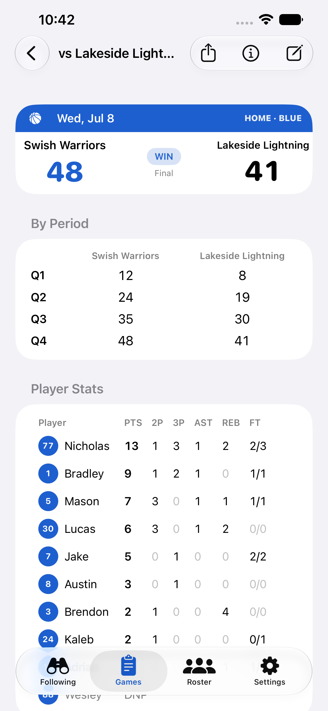 | 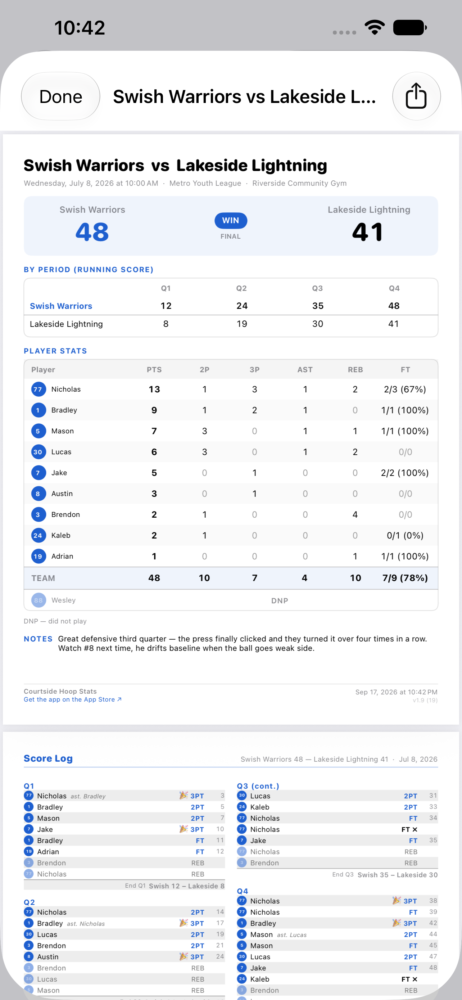 |

### Your team

| 7. Games | 8. Roster | 9. Teams (Settings) | 10. Jerseys |
|---|---|---|---|
| 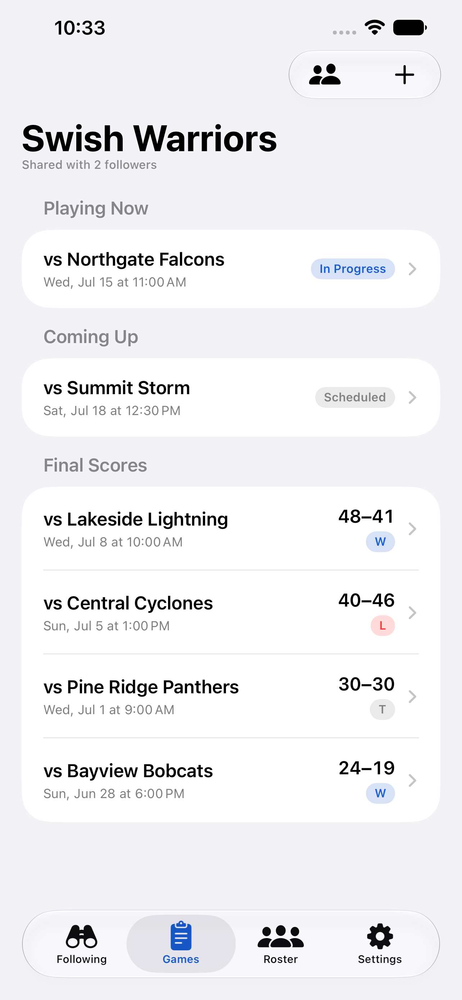 | 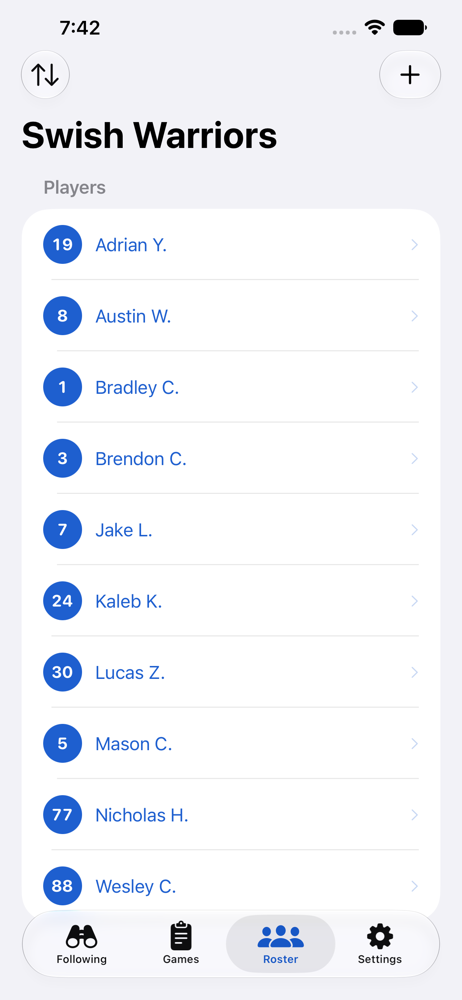 | 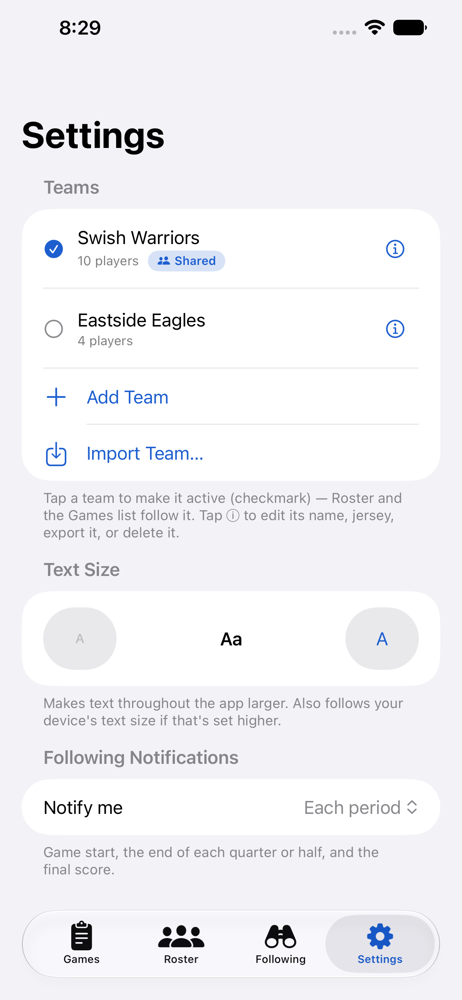 | 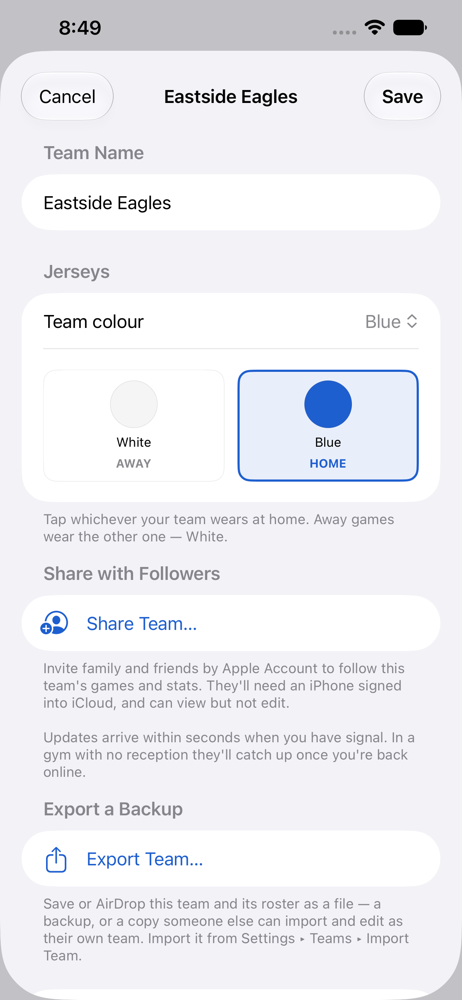 |

### Following a shared team

What a **follower** sees — the same scores and stats, with no way to change
anything. The tab appears only once a team has actually been shared with you.

| 11. Teams you follow | 12. Watching a game |
|---|---|
| 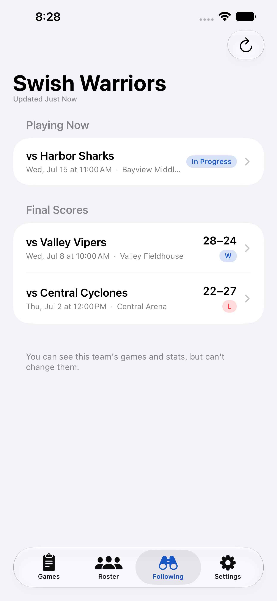 | 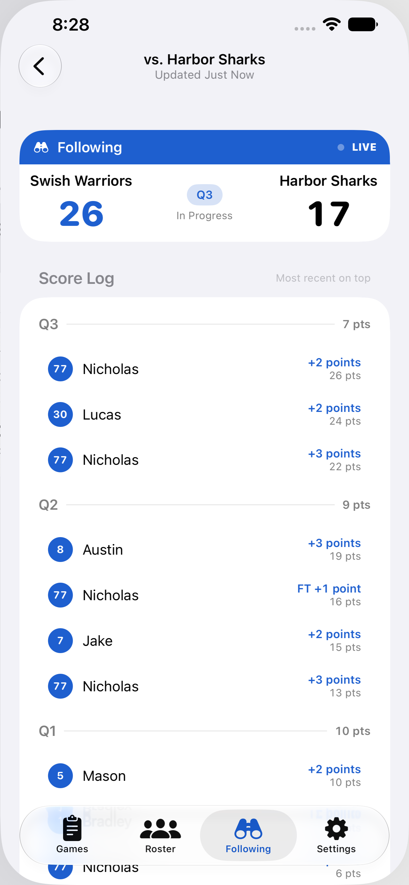 |

## What it does

- **Live scoring** — tap a player → a big point pad (+2 / +3 / FT ✓ / FT ✗).
  Players show by **first name** for fast, unambiguous tapping. The score log
  stays on top (with sticky period headers); players sit in the thumb zone.
  Bench absent players; reorder or edit any entry.
- **Games** — tap **+** to open the New Game form, where every field is optional.
  Hit **Start Game** to begin scoring right away, or **Save** to schedule it for
  later.
- **Teams** — manage multiple teams in Settings, and **export a backup** of a
  team's **roster** to move it between devices or keep a copy (games aren't
  included). Roster and Games follow the active team.
- **Share with followers** — let family and friends watch a team's games and
  stats from their own iPhone. Invite them by Apple Account from the standard
  iOS share sheet (Messages / Mail / AirDrop), exactly like an iCloud Shared
  Album; they get a **read-only** view in a **Following** tab and can't change
  anything. Built on CloudKit, so there's no account to create and no server.
  Followers are **notified** when a game starts, at each period end, and at the
  final score — with a cadence setting, down to off. Updates land within seconds
  when you have signal, and catch up once you're out of a gym with no reception.
- **Summary** — final score, cumulative by-period linescore, and per-player stats
  including **FT%** (e.g. `5/6 (83%)`). Players who sat the game out are listed
  **DNP** rather than dropped from the roster.
- **Box score PDF** — export the summary as a clean one-page PDF and share it
  (AirDrop / Messages / Files). Preview it first, so you see exactly what lands
  in the parents' group chat. Players who didn't play are listed **DNP**,
  NBA-style. Rendered on device; nothing is uploaded.

## Build

```bash
open CourtsideHoopStats.xcodeproj   # Xcode 16+, iOS 26 SDK
```

Set your signing **Team** on the CourtsideHoopStats target the first time.

Screenshots above are generated by the UI-test harness — run
`scripts/screenshots.sh` (see [`docs/SCREENSHOTS.md`](docs/SCREENSHOTS.md)).

The backlog lives in **GitHub Issues**. Product spec:
[`docs/REQUIREMENTS.md`](docs/REQUIREMENTS.md).
